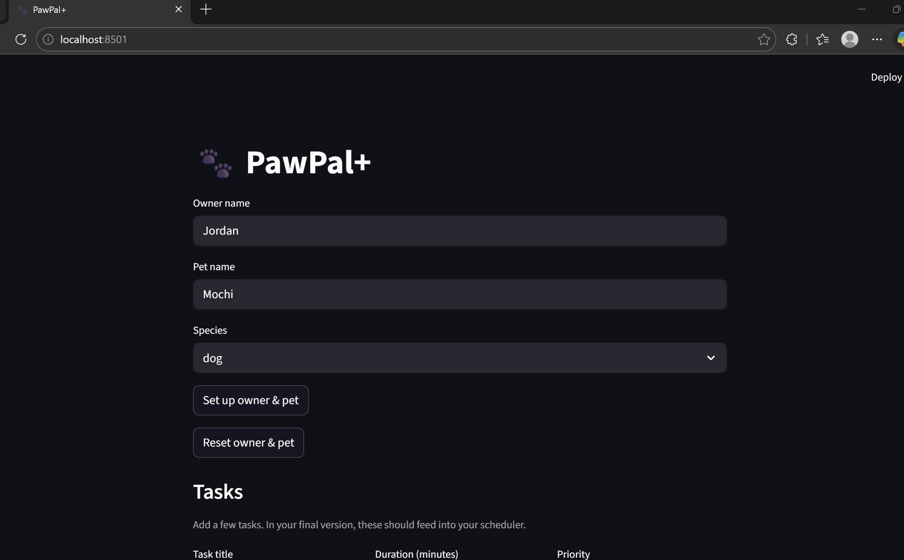

# PawPal+ (Module 2 Project)

You are building **PawPal+**, a Streamlit app that helps a pet owner plan care tasks for their pet.

## Scenario

A busy pet owner needs help staying consistent with pet care. They want an assistant that can:

- Track pet care tasks (walks, feeding, meds, enrichment, grooming, etc.)
- Consider constraints (time available, priority, owner preferences)
- Produce a daily plan and explain why it chose that plan

Your job is to design the system first (UML), then implement the logic in Python, then connect it to the Streamlit UI.

## What you will build

Your final app should:

- Let a user enter basic owner + pet info
- Let a user add/edit tasks (duration + priority at minimum)
- Generate a daily schedule/plan based on constraints and priorities
- Display the plan clearly (and ideally explain the reasoning)
- Include tests for the most important scheduling behaviors

## Getting started

### Setup

```bash
python -m venv .venv
source .venv/bin/activate  # Windows: .venv\Scripts\activate
pip install -r requirements.txt
```

### Run

```bash
streamlit run app.py
```



### Suggested workflow

1. Read the scenario carefully and identify requirements and edge cases.
2. Draft a UML diagram (classes, attributes, methods, relationships).
3. Convert UML into Python class stubs (no logic yet).
4. Implement scheduling logic in small increments.
5. Add tests to verify key behaviors.
6. Connect your logic to the Streamlit UI in `app.py`.
7. Refine UML so it matches what you actually built.

## Smarter Scheduling

The `pawpal_system.py` module adds several features that make the planner more realistic:

- **Flexible frequencies** — Tasks support `DAILY`, `TWICE_DAILY`, `WEEKLY`, `BIWEEKLY`, and `AS_NEEDED` schedules. `isDueOn()` checks each task against its history so it only appears on the right days.
- **Time-budget fitting** — `DailyPlan._fitToTimeWindow()` always includes required tasks, then fills remaining available minutes with optional tasks ordered by priority. Nothing optional gets scheduled if it would exceed the owner's time budget.
- **Auto-scheduling next occurrences** — When a `DAILY` or `WEEKLY` task is marked completed, `markTaskCompleted()` automatically creates a new task instance for the next due date so the plan stays continuous.
- **Conflict detection** — `detectConflicts()` flags any two tasks assigned to the same time slot, calling out same-pet and cross-pet overlaps separately.
- **Filtered views** — `filterBy()` lets the UI show only tasks matching a given status (e.g. `"pending"`) or a specific pet, making it easy to build progress-tracking dashboards.
- **Rich summaries** — `getTaskSummary()` and `getPlanSummary()` return structured dicts ready for display or export, and `getReason()` generates a plain-English explanation of why the plan looks the way it does.

## Testing PawPal+

### Run the test suite

```bash
python -m pytest test/test_pawpal.py -v
```

### What the tests cover

| Area | Description |
|---|---|
| **Task Scheduling & Recurrence** | Verifies `isDueOn()` for all frequencies — `DAILY`, `TWICE_DAILY`, `WEEKLY`, `BIWEEKLY`, `AS_NEEDED` — including boundary cases like tasks checked before their creation date and counters that reset on a new day. |
| **Recurrence Logic** | Confirms that marking a `DAILY` task complete automatically appends a new task instance with `createdAt` set to tomorrow, and that `TWICE_DAILY`/`BIWEEKLY` tasks correctly return `None` from `getNextOccurrence()`. |
| **Plan Generation** | Checks that required tasks are always included even when they exceed `availableMinutes`, that optional tasks are excluded when over budget, that exactly-fitting optional tasks are included, and that `availableMinutes=0` schedules only required tasks. |
| **Sorting Correctness** | Verifies `sortByPriority` places required tasks first, and `sortByTime` returns tasks in true chronological order — including the single-digit-hour edge case (e.g. `"9:00"` before `"10:00"`). |
| **Conflict Detection** | Confirms warnings are raised for same-pet and cross-pet time slot collisions, that three tasks in one slot produce all three pair-wise warnings, and that unscheduled tasks (`scheduledTime=None`) are excluded from conflict checks. |
| **Pet & Owner Guard Rails** | Validates that adding a duplicate task, adding a task with a mismatched `petId`, removing a non-existent task, setting an invalid priority, and updating protected fields all raise the correct exceptions. |

### Confidence Level

**3.5 / 5 stars**

The core scheduling logic such as due-date checks, time-budget fitting, priority sorting, conflict detection, and recurrence, are well-covered and all 35 tests pass. Confidence is held back for a few reasons:

- The `sortByTime` bug (lexicographic string comparison) existed in the original code and was only caught because a targeted test was written for it. Other format-assumption bugs could still be lurking.
- There are no tests for the Streamlit UI layer (`app.py`) or for `filterBy()`, `getPlanSummary()`, and `getReason()`.
- Edge cases around owner-level operations (e.g. `getAllTasksForDate` across multiple pets) are untested.

## Features

### Task Recurrence Engine
Each task carries a `frequency` (Daily, Twice Daily, Weekly, Biweekly, or As Needed) and a `lastCompleted` date. The `isDueOn()` method uses these to determine whether a task belongs on a given day — skipping tasks already finished, waiting the right number of days for weekly and biweekly tasks, and allowing as-needed tasks to always appear.

### Twice-Daily Completion Tracking
Tasks marked `TWICE_DAILY` track how many times they've been completed today with a `dailyCompletionCount` counter. The counter resets automatically when a new day begins, and a task is only considered fully complete once it reaches two completions — showing as `partially_completed` in between.

### Auto-Scheduling Next Occurrence
When a task is marked complete, the system automatically generates the next occurrence and adds it to the pet's task list. Daily tasks recur the next day; weekly tasks recur in seven days. This keeps the schedule self-maintaining without any manual re-entry.

### Priority-Based Time-Window Fitting
The scheduler fits tasks into the owner's available time budget using a two-pass algorithm. Required tasks are always included first, regardless of how long they take. Optional tasks are then ranked by priority (high to low) and added one by one until the time budget is exhausted — ensuring the most important optional tasks are never dropped first.

### Conflict Detection
After a plan is built, the system scans for tasks that share the same scheduled time slot. Any overlap — whether two tasks for the same pet or tasks across different pets — is flagged and returned as a human-readable warning string, making it easy to surface conflicts in the UI.

### Flexible Plan Sorting
A generated plan can be re-sorted two ways without rebuilding it: by priority (required tasks first, then highest-to-lowest priority) or by scheduled time (chronological order, with unscheduled tasks placed at the end).

### Status and Pet Filtering
The plan supports live filtering by task status (`pending`, `partially_completed`, `completed`, `skipped`) and by pet name. Filters can be combined and applied without modifying the underlying plan, so the original schedule is always preserved.

### Plain-English Plan Explanation
After scheduling, the system generates a short narrative summary describing which tasks were included, whether they were required or optional, and the total estimated time. This gives the owner a quick at-a-glance reason for why the day looks the way it does.

### Protected Field Updates
All classes expose an `update` method that uses an allowlist to control which fields can be changed at runtime. Attempts to modify identity fields like `petId`, `taskId`, or `ownerId` raise an error immediately, preventing accidental data corruption.
