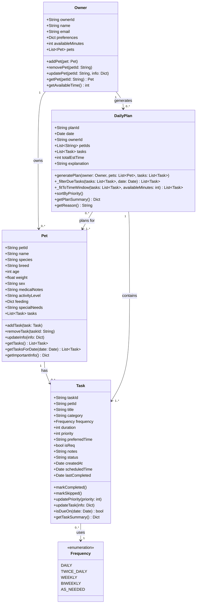

# UML Diagram — PawPal+

## Changes from original

| What changed | Where | Why |
|---|---|---|
| `Frequency` enum added | new class | Replaces freeform `frequency: str` — `isDueOn` needs a finite set of values |
| `Task.frequency` → `Frequency` type | `Task` | Uses enum instead of raw string |
| `Task.createdAt` added | `Task` | Anchor date for recurrence — `isDueOn` needs a start reference |
| `Task.scheduledTime` added | `Task` | Stores assigned time slot after `generatePlan` places the task |
| `Task.lastCompleted` added | `Task` | Lets `isDueOn` skip already-done tasks and compute gaps for weekly/biweekly |
| All `*Id` fields use UUID default | all classes | Objects can be created without manually passing IDs |
| `Owner.availableMinutes` added | `Owner` | Explicit field (e.g. `90`) used by scheduler — not buried in `preferences` dict |
| `DailyPlan.petIds` added | `DailyPlan` | Plan tracks which pets it covers without holding full `Pet` objects |
| `DailyPlan._filterDueTasks()` added | `DailyPlan` | Breaks `generatePlan` into a testable step — filters by due date |
| `DailyPlan._fitToTimeWindow()` added | `DailyPlan` | Breaks `generatePlan` into a testable step — trims tasks to available time |
