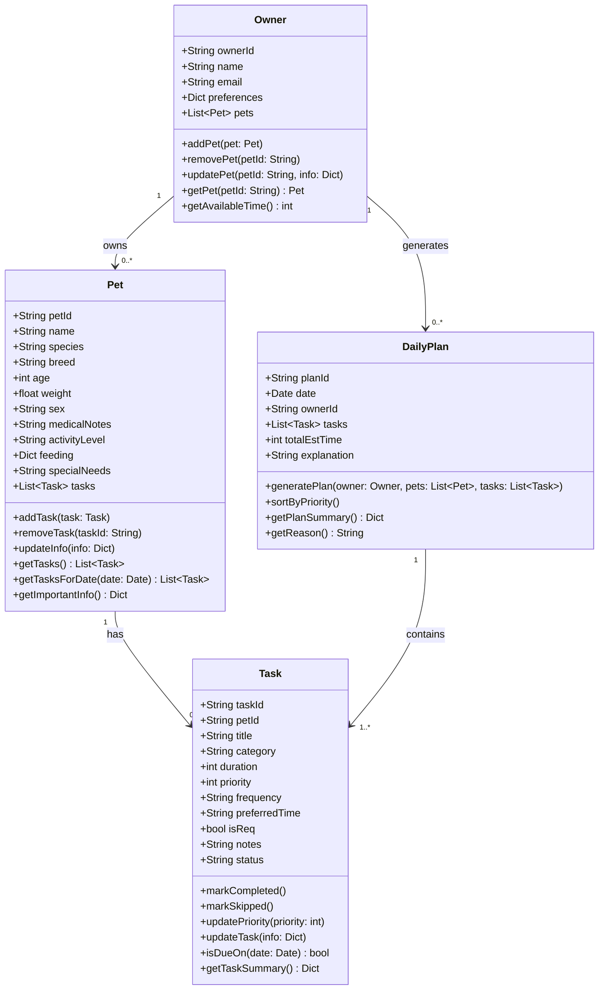

# UML Diagram — PawPal+

```mermaid
classDiagram
    class Owner {
        +String ownerId
        +String name
        +String email
        +Dict preferences
        +List~Pet~ pets
        +addPet(pet: Pet)
        +removePet(petId: String)
        +updatePet(petId: String, info: Dict)
        +getPet(petId: String) Pet
        +getAvailableTime() int
    }

    class Pet {
        +String petId
        +String name
        +String species
        +String breed
        +int age
        +float weight
        +String sex
        +String medicalNotes
        +String activityLevel
        +Dict feeding
        +String specialNeeds
        +List~Task~ tasks
        +addTask(task: Task)
        +removeTask(taskId: String)
        +updateInfo(info: Dict)
        +getTasks() List~Task~
        +getTasksForDate(date: Date) List~Task~
        +getImportantInfo() Dict
    }

    class Task {
        +String taskId
        +String petId
        +String title
        +String category
        +int duration
        +int priority
        +String frequency
        +String preferredTime
        +bool isReq
        +String notes
        +String status
        +markCompleted()
        +markSkipped()
        +updatePriority(priority: int)
        +updateTask(info: Dict)
        +isDueOn(date: Date) bool
        +getTaskSummary() Dict
    }

    class DailyPlan {
        +String planId
        +Date date
        +String ownerId
        +List~Task~ tasks
        +int totalEstTime
        +String explanation
        +generatePlan(owner: Owner, pets: List~Pet~, tasks: List~Task~)
        +sortByPriority()
        +getPlanSummary() Dict
        +getReason() String
    }

    Owner "1" --> "0..*" Pet : owns
    Pet "1" --> "0..*" Task : has
    Owner "1" --> "0..*" DailyPlan : generates
    DailyPlan "1" --> "1..*" Task : contains
```
